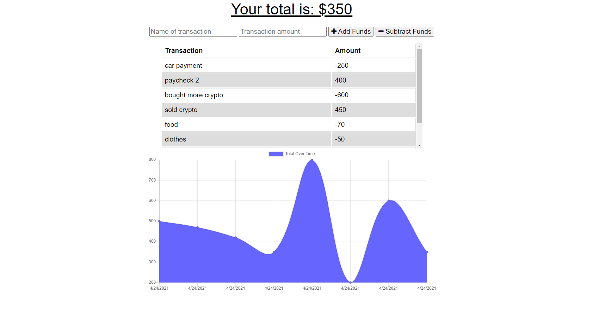

# Budget-Tracker

## Description
This is a progressive web app for tracking your expenses and deposites and shows you your overall budget on a graph for a visual representaion of your spending. This app stores data in a mongo database using a mongoose schema, it is hosted on heroku using mongo atlas to connect the database. The offline functionality is possible through the use of the service worker using the local cache storage and indexedDB to store the network requests until the network is back online.

## Table of Contents
* [Usage](#Usage)
* [Demonstration](#Demonstration)
* [License](#License)
* [Questions](#Questions)

## Usage
To use this app simply follow the heroku link below to access the website. Once on the site, enter the name of the transaction and the amount you will be depositing or withdrawing, then click the add funds or subtract funds button and the graph will update the total budget on the account.

### Deployed application link - https://boiling-refuge-26689.herokuapp.com/

## Demonstration

## License
MIT License - Copyright 2021 Patrick-Kaczmar

    Permission is hereby granted, free of charge, to any person obtaining a copy of this software and associated documentation files (the "Software"), to deal in the Software without restriction, including without limitation the rights to use, copy, modify, merge, publish, distribute, sublicense, and/or sell copies of the Software, and to permit persons to whom the Software is furnished to do so, subject to the following conditions:
    
    The above copyright notice and this permission notice shall be included in all copies or substantial portions of the Software.
    
    THE SOFTWARE IS PROVIDED "AS IS", WITHOUT WARRANTY OF ANY KIND, EXPRESS OR IMPLIED, INCLUDING BUT NOT LIMITED TO THE WARRANTIES OF MERCHANTABILITY, FITNESS FOR A PARTICULAR PURPOSE AND NONINFRINGEMENT. IN NO EVENT SHALL THE AUTHORS OR COPYRIGHT HOLDERS BE LIABLE FOR ANY CLAIM, DAMAGES OR OTHER LIABILITY, WHETHER IN AN ACTION OF CONTRACT, TORT OR OTHERWISE, ARISING FROM, OUT OF OR IN CONNECTION WITH THE SOFTWARE OR THE USE OR OTHER DEALINGS IN THE SOFTWARE.

## Questions
Patrick-Kaczmar's GitHub profile - https://github.com/Patrick-Kaczmar

If there are any additional questions about this repository please contact me at pk1blue@yahoo.com
